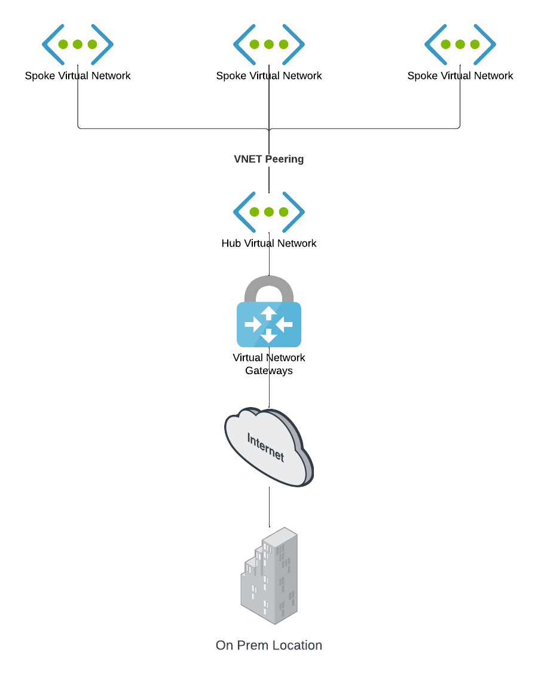

# Hub and Spoke VNET Topology

:cloud: - [Introduction](#introduction) - [Design](#design) - [Deployment](#deployment) - [Requirements](#requirements-and-limitations) - [Configuration](#configuration) - :cloud:

## Introduction

## Design

## Deployment

### Azure Portal

## Requirements-and-limitations

## Configuration